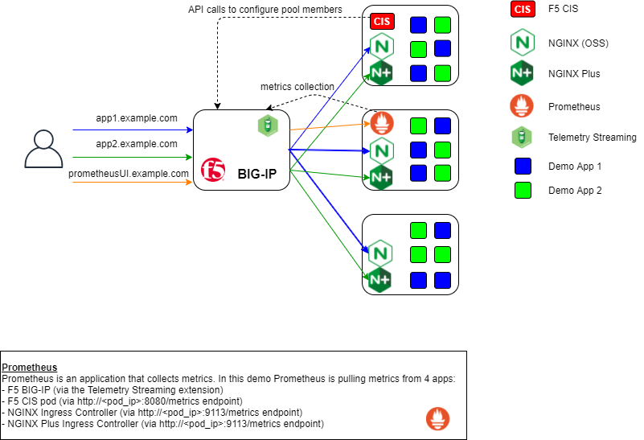
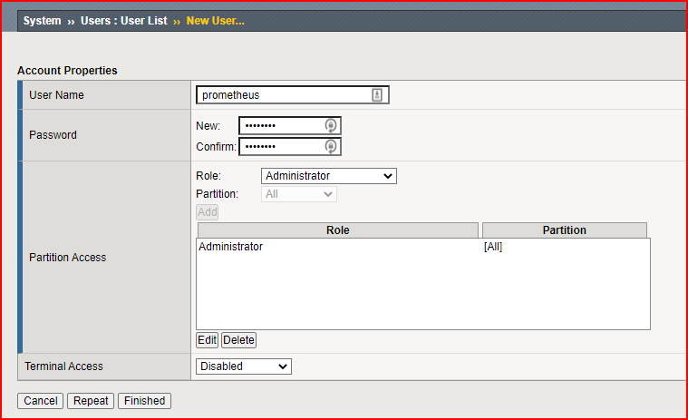

# User guide for Prometheus and F5 examples
User guide to deploying Prometheus and collecting metrics from Telemetry Streaming (TS), Container Ingress Services (CIS), and NGINX Kubernetes Ingress Controller (KIC).

In the case of KIC, we will deploy both open source KIC (i.e., free community version), and KIC using NGINX Plus (i.e., requires paid license or demo key).

This guide is heavily based on the work done by Mark Dittmer [here](https://github.com/mdditt2000/k8s-bigip-ctlr/tree/main/user_guides/prometheus). This guide mostly exists to add NGINX KIC to Mark's user guide and demonstrate the added value of KIC with NGINX Plus.

This guide also uses different Custom Resources to expose services in K8s. F5's IngressLink is used to expose KIC, and TransportServer is used to expose KIC with NGINX Plus. The reason behind the different types is simply to demo their use.

## Architecture diagram


## Prerequisites
All instructions for configuragtion of prerequisites are provided or linked to below.
- A running K8s cluster version >1.18.
- A running BIG-IP in standalone or HA cluster
  - BIG-IP must be able to route to the pod network (hosted K8s services or VXLAN/BGP has been configured).
  - Telemetry Streaming (TS) must be [installed](https://clouddocs.f5.com/products/extensions/f5-telemetry-streaming/latest/installation.html).
- NGINX Plus license or demo cert/key pair.
- A private container image of NGINX Plus KIC built using Docker commands outlined [here](https://docs.nginx.com/nginx-ingress-controller/installation/building-ingress-controller-image/)
- A private container registry hosting the image of your KIC image based on NGINX Plus.

## CIS (Container Ingress Services)
1. Edit the file /ingress/cis/cis1.yaml and change the IP address around line 49 so that CIS points to the BIG-IP's mgmt IP address.
2. Optionally, /ingress/cis/cis2.yaml if you have 2 BIG-IP's in an HA pair, with the same IP address change.
3. Edit the file /ingress/cis/secret_sa_rbac.yaml. The password in the secret should be the base64-encoded value of your BIG-IP admin password.
4. Install CIS with the following commands:
```bash
kubectl apply -f ingress/cis/secret_sa_rbac.yaml
kubectl apply -f ingress/cis/crd-definition/customresourcedefinitions.yaml
kubectl apply -f ingress/cis/cis1.yaml
kubectl apply -f ingress/cis/cis2.yaml
```

## NGINX KIC (Kubernetes Ingress Controller)
Install KIC using the open source, freely-available image from Docker Hub. Official instructions from NGINX are [here](https://docs.nginx.com/nginx-ingress-controller/installation/installation-with-manifests/) but for this demo you can run the commands below.
1. Edit the file ingress/nginx/vs-ingresslink.yaml and provide the desired IP of the VIP on F5. Optionally do this with vs-ingresslink2.yaml if you are running BIG-IP in HA.
2. Run the commands below:
````bash
    #create namespace, rbac, tls, configmap, and ingress class to support KIC
    kubectl apply -f ingress/nginx/common/ns-and-sa.yaml
    kubectl apply -f ingress/nginx/rbac/rbac.yaml
    kubectl apply -f ingress/nginx/common/default-server-secret.yaml
    kubectl apply -f ingress/nginx/common/nginx-config.yaml
    kubectl apply -f ingress/nginx/common/ingress-class.yaml
    
    #Create CRD's
    kubectl apply -f ingress/nginx/crd/k8s.nginx.org_policies.yaml
    kubectl apply -f ingress/nginx/crd/k8s.nginx.org_transportservers.yaml
    kubectl apply -f ingress/nginx/crd/k8s.nginx.org_virtualserverroutes.yaml
    kubectl apply -f ingress/nginx/crd/k8s.nginx.org_virtualservers.yaml
    
    #Run the Ingress Controller
    kubectl apply -f ingress/nginx/deployment/nginx-ingress.yaml

    #Expose NGINX ingress via cluster IP service
    kubectl apply -f ingress/nginx/service/service.yaml
    
    #Create F5 IngressLink resources to expose NGINX Plus ingress controller via F5 BIG-IP
    kubectl apply -f ingress/nginx/vs-ingresslink.yaml
    kubectl apply -f ingress/nginx/vs-ingresslink2.yaml
    
````
## Demo App 1 (nginx helloworld page)
This demo app will display an NGINX "helloworld" web page. Run the following commands to deploy it:
````bash
    #create a new namespace for this app
    kubectl apply -f apps/nginx-helloworld/ns.yaml
    #deploy the app. We'll make a replica set of 3 pods
    kubectl apply -f apps/nginx-helloworld/deployment.yaml
    #expose the pods as a service on port 80
    kubectl apply -f apps/nginx-helloworld/service.yaml
    #create an ingress resource that KIC will configure KIC to route traffic to these pods
    kubectl apply -f apps/nginx-helloworld/ingress.yaml
````

## NGINX Plus KIC
For the purpose of demonstration, we will also deploy KIC based on NGINX Plus. This will demonstrate the [benefits of NGINX Plus](https://www.nginx.com/products/nginx/#compare-versions).
1. Save your login details for your private container registry as a K8s secret. Edit the file /ingress/nginx-plus/common/docker-login-secret.yaml and follow the [instructions from Kubernetes docs](https://kubernetes.io/docs/tasks/configure-pod-container/pull-image-private-registry/) if needed. The line with ```.dockerconfigjson``` should have the base64-encoded file from your local file ```~/.docker/config.json```
2. Edit the file /ingress/nginx-plus/deployment/nginx-plus-deployment.yaml and around line #23 you will edit the location from which to pull your NGINX Plus KIC image.
3. Edit the file /ingress/nginx-plus/vs-ts.yaml around line #9 and provide the desired IP of the VIP on F5. Optionally do this with vs-ts2.yaml if you are running BIG-IP in HA.
4. Then run the following commands to install NGINX Plus Ingress Controller.
````bash
    #create namespace, rbac, tls, configmap, and ingress class to support KIC
    kubectl apply -f ingress/nginx-plus/common/ns-and-sa.yaml
    kubectl apply -f ingress/nginx-plus/rbac/rbac.yaml
    kubectl apply -f ingress/nginx-plus/common/default-server-secret.yaml
    kubectl apply -f ingress/nginx-plus/common/nginx-plus-config.yaml
    kubectl apply -f ingress/nginx-plus/common/ingress-class.yaml
    
    #Run the Ingress Controller
    kubectl apply -f ingress/nginx-plus/deployment/nginx-plus-ingress.yaml

    #Expose NGINX ingress via cluster IP service
    kubectl apply -f ingress/nginx-plus/service/service.yaml
    
    #Create F5 TransportServer resource to expose NGINX Plus ingress controller via F5 BIG-IP
    kubectl apply -f ingress/nginx-plus/vs-ts.yaml
    kubectl apply -f ingress/nginx-plus/vs-ts2.yaml
````

## Demo App 2 (f5 helloworld page)
This demo app will display an F5 "helloworld" web page. Run the following commands to deploy it:
````bash
    #create a new namespace for this app
    kubectl apply -f apps/f5-helloworld/ns.yaml
    #deploy the app. We'll make a replica set of 3 pods
    kubectl apply -f apps/f5-helloworld/deployment.yaml
    #expose the pods as a service on port 80
    kubectl apply -f apps/f5-helloworld/service.yaml
    #create an ingress resource that KIC will configure KIC to route traffic to these pods
    kubectl apply -f apps/f5-helloworld/ingress.yaml
````

## Prometheus
Prometheus is a free software application used for event monitoring and alerting. We will deploy Prometheus in a pod inside Kubernenetes so that it can pull metrics from other pods, using the K8s api to discover other pods using their annotations and labels.

### BIG-IP preparation
1. Create a user called "prometheus" with Admin credentials on the BIG-IP. Create a password and remember it (you will need it in the prometheus configMap later). You can use this command
````bash
tmsh create auth user prometheus partition-access add { all-partitions { role admin } } prompt-for-password
````
or do this via the GUI:


2. Ensure that Telemetry Streaming is installed on BIG-IP. This was listed as a prerequisite.
3. Configure the Telemetry Streaming declaration by running the curl commands below:

````bash
curl -kv -u admin:<password_for_bigip1> https://<mgmt_addr_of_bigip>/mgmt/shared/telemetry/declare -d @apps/monitoring/ts-declaration.json -H "content-type:application/json"
curl -kv -u admin:<password_for_bigip2> https://<mgmt_addr_of_bigip>/mgmt/shared/telemetry/declare -d @apps/monitoring/ts-declaration.json -H "content-type:application/json"
````
### Prometheus deployment
After TS is installed , edit some of the files below to configure for your environment.
1. The file ```apps/monitoring/config-map.yaml``` will need to be edited around lines #164 and #166 to include the password of your prometheus user on BIG-IP, and the management IP's of your devices.
2. If you have deployed NGINX or F5 CIS without following the instructions above, with different manifest files, or if you have changed any labels, look over this file and ensure that the labels configured in this config file match your values.
3. Edit the file apps/monitoring/vs-ts.yaml and provide the desired IP of the VIP on F5. Optionally do this with vs-ts2.yaml if you are running BIG-IP in HA.

run the commands below to install and configure Prometheus

````bash
kubectl apply -f apps/monitoring/ns.yaml
kubectl apply -f apps/monitoring/clusterrole.yaml
kubectl apply -f apps/monitoring/config-map.yaml
kubectl apply -f apps/monitoring/prometheus-deployment.yaml
kubectl apply -f apps/monitoring/prometheus-service.yaml
kubectl apply -f apps/monitoring/vs-ts.yaml
kubectl apply -f apps/monitoring/vs-ts2.yaml
````


